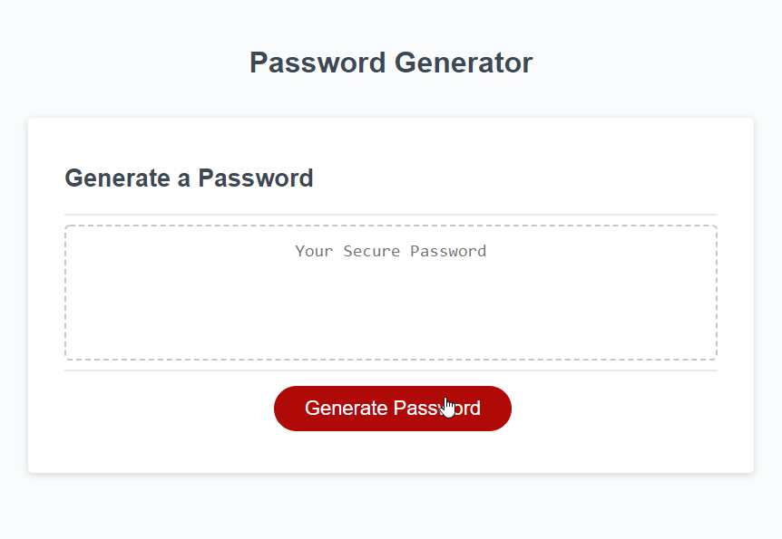

# **JavaScript Password Generator**


&nbsp;
## **Description**
JavaScript Password Generator is a simple and straightforward to use website to generate a random password. The website is created with HTML and styled with CSS. The functionality of the password generation is performed by a JavaScript function (`generatePassword`) and is initiated through an event listener attached to a button. 

A site user, upon initiating a random password generation is prompted with a series of questions to select which categories of characters (lower case letters, upper case letters, numbers, and symbols) to include in the password and how many characters to include in the password. Basic input validation is performed to ensure the user selected at least one of the the character type categories and that the input password length is a whole number between 8 and 128. 

The `generatePasswordText` function is then called with the user inputs and returns a password. The returned password is guaranteed to include at least one character from each character category selected to include in the password. 


&nbsp;
## **[Live Application](https://spfave.github.io/gwu_hw3_password_gen/)**

Demo interaction



&nbsp;
## **Password Generation**

#### Table of available password character types and their available characters

| Character Type     | Characters                         |
|--------------------|------------------------------------|
| Lower case letters | `abcdefghijklmnopqrstuvwxyz`       |
| Upper case letters | `ABCDEFGHIJKLMNOPQRSTUVWXYZ`       |
| Numbers            | `012346789`                        |
| Symbols            | ```~`!@#$%^&*()-_=+[]{}\|;:'",.<>/?``` |

&nbsp;
#### Password Generation Algorithm
The `generatePasswordText` function takes as input an array of character types to use in the password and a password length (i.e. number of characters). 

To ensure the generated password includes at least one character of each character type selected the `generatePasswordText` function first loops through the list of password character types selected for use and randomly selects a character value of that type to add to the password. To fill in the remaining password characters the `generatePasswordText` randomly selects one of the character types selected for the password and then randomly selects a character value of that type to add to the password. The final password character array is randomly shuffled and joined in a single string and displayed to the user. 

The `shuffleArray` function implements the [Dursrenfeld shuffle](https://en.wikipedia.org/wiki/Fisher%E2%80%93Yates_shuffle#The_modern_algorithm), an optimized version of the the Fisher-Yates shuffle algorithm. This shuffle algorithm was selected for use after online research that stemmed from this question on [Stack overflow](https://stackoverflow.com/questions/2450954/how-to-randomize-shuffle-a-javascript-array).